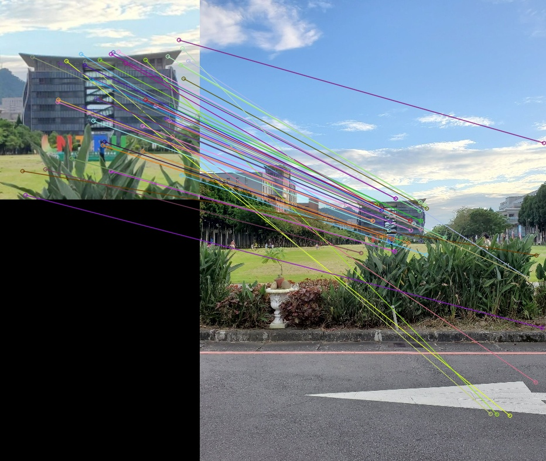

## Computer Vision Midterm Project
- 410978049 統計4 江泓志

I present SURF method implemented with Python here to matching two image with their descriptors computed using SURF method. 

> The performance of scale invariance in the image is not that good, though.

List of files:
1. surf_module.py - Include :
   - SURF(class) to compute keypoints
   - SURF_Matcher(class) to compare keypoints and descriptors of two image  

2. surf_naive.py - You can input a image and it will output a image with keypoint (aware of path, there is a bit of messyl)

3. surf_match_adv.py - You can input a base image and do some transformation like rotate or rescale, then the script will output the result of base image compare to all the other transformed image 

4. SURF.pdf - The slides I used for the midterm presentation

5. images/ntpu - It is a image set, there are base image and transformed images

6. output - The output of surf_naive.py will locate here

7. ntpu_result - The outputs of surf_match_adv.py will locate here

> This project was uploaded to GitHub on April 14, 2024.
